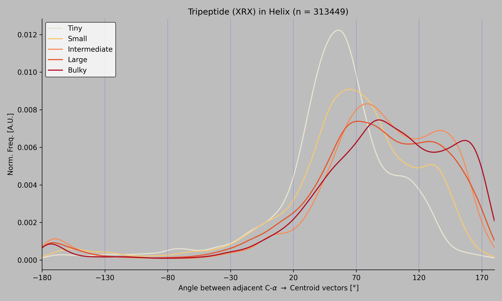

# Protein Side-Chain Angle Analysis Pipeline (BET-104)


## Results Summary

The following density plot illustrates the distribution of side-chain rotation angles for the target residue (ARG) within Alpha-Helical (HHH) contexts, categorized by the size of the neighboring residue.



### Dataset Transparency
A comprehensive list of the 50,000+ PDB structures that passed structural filters and contributed to the final calculation can be found here:
 [`results/pdbs.txt`](results/pdbs.txt)

---

## Project Architecture

The pipeline is modularized into four core stages:
1. **`pipeline.py`**: A high-speed parallel driver for initial structural parsing.
2. **`extract_triplets.py`**: Filters sequence windows for specific secondary structures.
3. **`angle_calc.py`**: Performs 3D vector geometry to determine side-chain rotation.
4. **`plot_distributions.py`**: Generates the final statistical visualization.

---

##  Execution Guide

To replicate this analysis, ensure you have the required PDB files located in a `/pdbs` directory at the project root.

### One-Line Execution
As requested, use the following command to execute the full DAG-aware pipeline:
```bash
snakemake --cores 8
